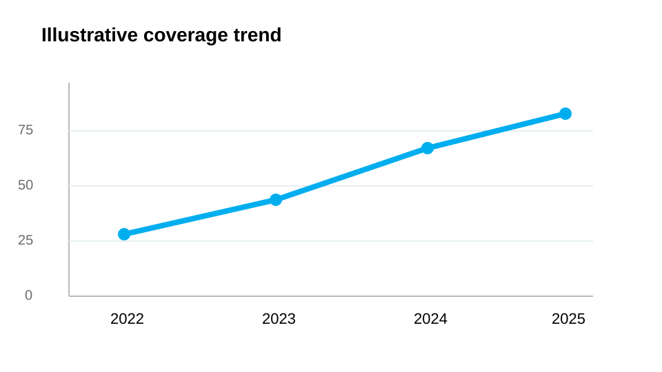
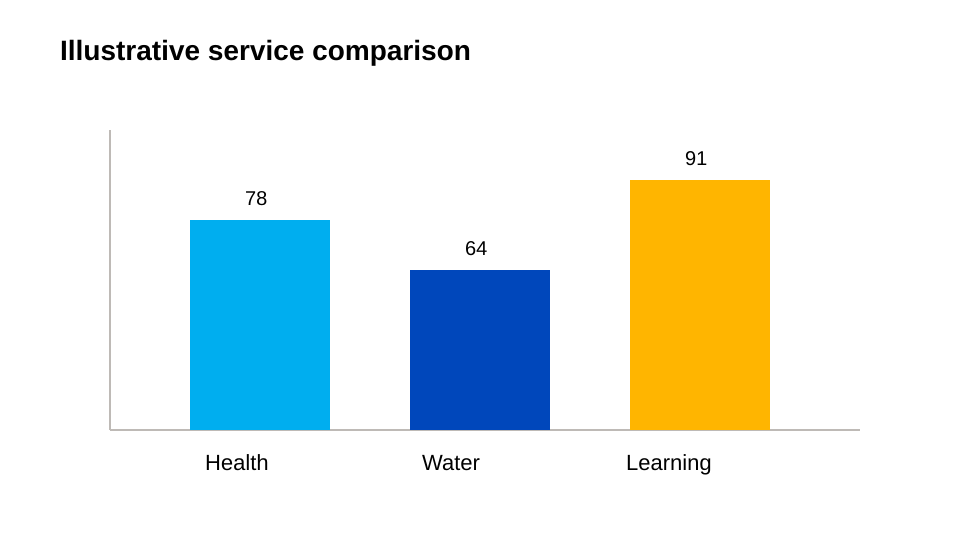

<p class="article-meta">Sample post • Data and figures • Updated 2026-04-30</p>

<p class="lede">Analytical UNICEF content often needs to combine narrative clarity with charts, figures, captions, and methodological transparency. This sample page shows one way to do that in a Quarto-native layout.</p>

## Why Visual Evidence Matters

In UNICEF-style reporting, figures should clarify rather than decorate. Each chart needs a clear title, a concise caption, and a visual hierarchy that keeps UNICEF Blue central without turning every chart into the same shape.

::: {.callout-note title="Figure guidance"}
Use charts as evidence. Make the caption useful enough that a reader scanning quickly can still understand what the figure is showing.
:::

## Sample Figures

See @fig-coverage for a simple trend view and @fig-services for a category comparison.

{#fig-coverage fig-cap="Illustrative vaccination coverage trend. The point is not the specific values but the clarity of a simple, captioned chart structure in a UNICEF-style report."}

{#fig-services fig-cap="Illustrative comparison of service reach across three categories. Use strong labels, limited colors, and a clear baseline before adding visual complexity."}

## Sample Data Table

| Programme area | 2024 value | Change vs. prior year |
|---|---:|---:|
| Vaccination outreach | 78 | +8 |
| Safe water access | 64 | +5 |
| Learning support | 59 | +11 |

The table above is intentionally compact. It complements the figures instead of repeating every detail from them.

## Narrative Structure Around Figures

When combining prose and evidence:

- introduce the point before the chart appears
- keep captions short but concrete
- use callouts sparingly to frame interpretation
- do not overload one page with too many unrelated figure styles

::: {.callout-important title="Editorial pattern"}
Lead with the meaning, then show the chart, then return to the implication for children, communities, or delivery priorities.
:::

## Lightweight Figure Placeholder Pattern

When the final charts are not ready, use clearly labeled placeholders during drafting rather than decorative mock figures that could be mistaken for real data.

```yaml
image: cover-data.svg
categories: [data, reports, quarto]
description: "A sample post demonstrating figures, chart placeholders, and analytical storytelling."
```

That keeps the listing experience coherent while leaving room for production assets later.

## Closing Note

<div class="cta-banner">
  <h3>Use this as a report template</h3>
  <p>Swap the placeholder figures for approved production charts, then add source notes, methodology details, and accessible figure descriptions as part of the publishing workflow.</p>
  <p><a class="btn btn-primary" href="../../stories.qmd">View all stories</a></p>
</div>
